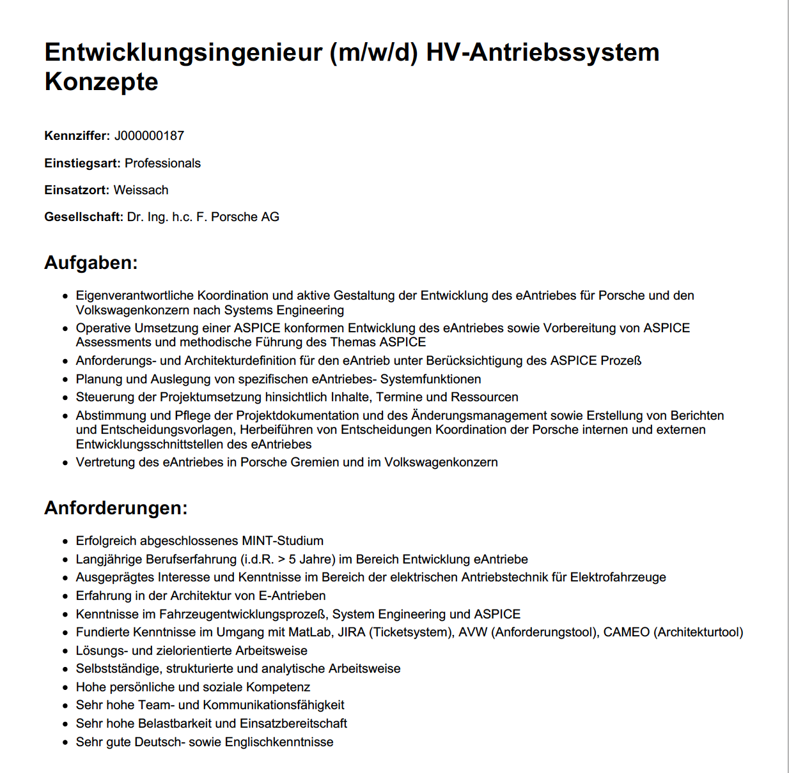

<h1 align="center">
  <br>
  <a href="https://jobs.porsche.com/index.php?ac=search_result"></a>
  <br>
  jobads-scrapy
  <br>
</h1>

<h4 align="center">A minimal webscraper for scraping porsche job ads from <a href="https://jobs.porsche.com/index.php?ac=search_result" target="_blank">jobs.porsche.com</a>.</h4>
<p align="center">
    

      
</p>

<p align="center">
  <a href="#key-features">Key Features</a> •
  <a href="#how-to-use">How To Use</a> •
  <a href="#credits">Credits</a>
</p>



## Project structure

```bash
|-- data
|-- github
|-- results
|-- scripts
|-- src
|-- tests
 -- .gitignore
 -- config.py
 -- environment.yml
 -- README.md
 -- setup.py
```

data: Where the raw data of the project is stored.

github: Images for the github repo. (Not relevant for the project)

results: Where the generated PDF results are stored.

scripts: Main script to run the project

src: Reusable Python modules for the project. Can be installed using the setup.py

## Key Feature

* Get URLs of Porsche job ads
  - Get URLs of the currently available jobs using Porsches API with variable filters.
* Get information of job ads from defined URLs
  - Run the scrapy spider to get the information from defined URLS
* Auto generate a PDF File based on HTML and css and scraped information

## How To Use

Clone the repository and nivagate into repo.
```bash
# Clone this repository
$ git clone https://github.com/yonwalone/jobads-scrapy.git

# Go into the repository
$ cd jobads-scrapy
```

It's recommended to use conda as package manager and virtual env:
* Create a conda venv with the environment.yml file
* Activate the environment
```bash
conda env create --file=environments.yml
conda activate py310-jobads-scrapy
```

Pip install additional packages that could not be installed using conda.
```bash
pip install jinja2
pip install pdfkit
pip install scrapy-playwright
```

Install the src folder as pip package.
```bash
pip install -e .
```

> **Note**
> If you are using a different OS with different architecture some pip packages may be available via conda.

## Credits

This software uses the following open source packages:

- [NumPy](https://numpy.org/)
- [Scrapy](https://scrapy.org/)
- [PDFKit](https://pdfkit.org/)
- [Jinja2](https://jinja.palletsprojects.com/en/2.10.x/)
- [Playwright for Python](https://github.com/microsoft/playwright-python)

---
> GitHub [@yonwalone](https://github.com/yonwalone)


